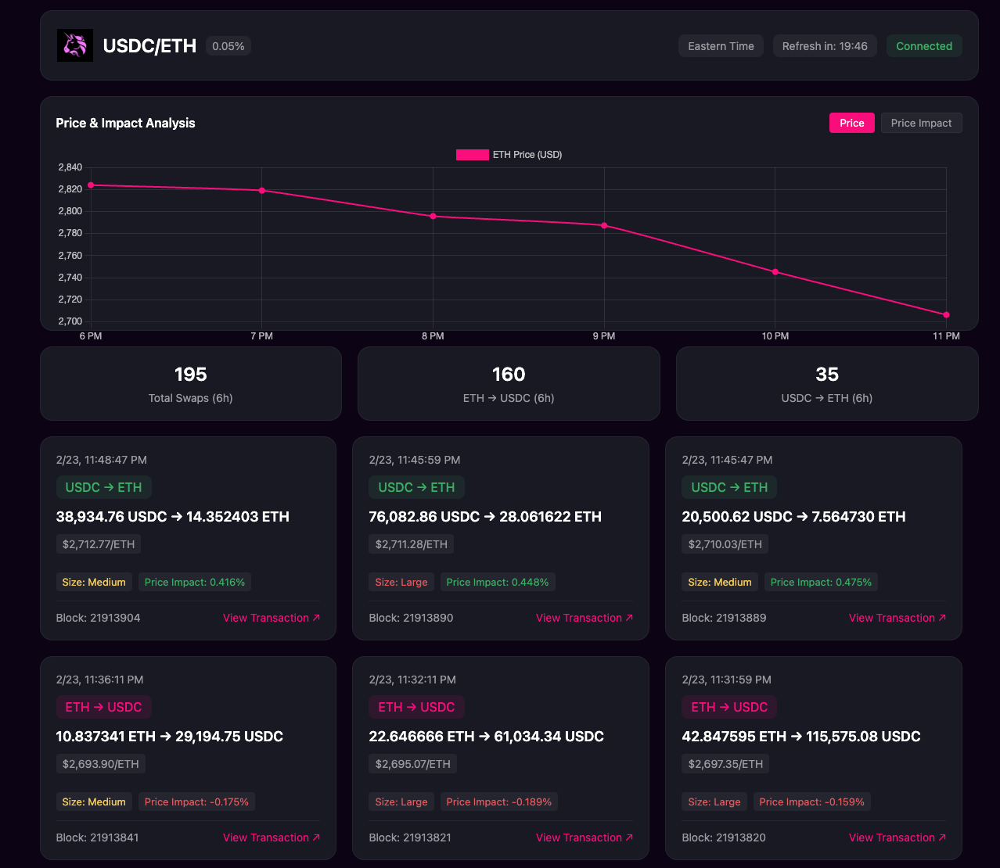
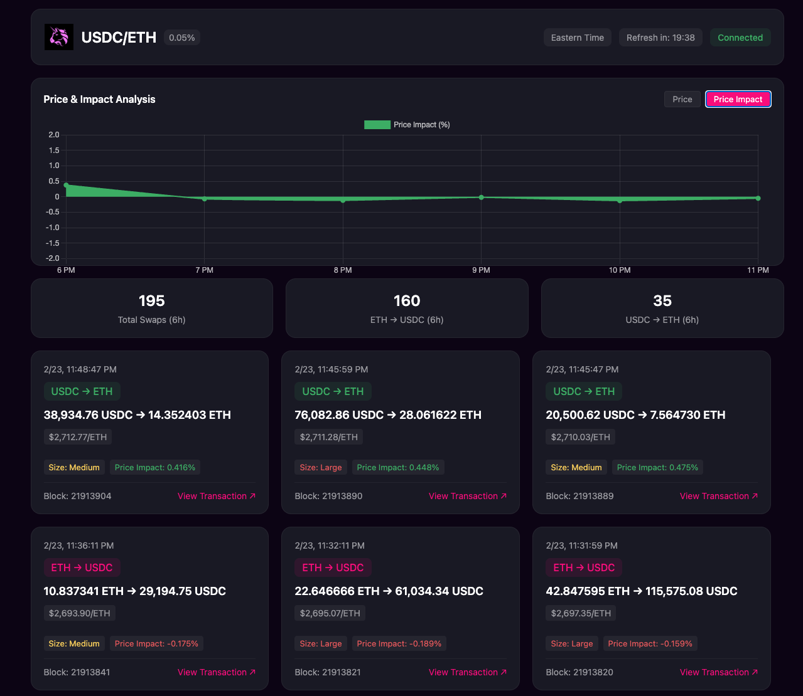

# Uniswap ETH-USDC Transaction Monitor

A real-time transaction monitor for the Uniswap V3 USDC/ETH 0.05% pool that tracks price movements and calculates price impact for each swap. Data refreshes every 20 minutes to provide a clear view of market activity.

## Screenshots



### Installation

1. Clone the repository:
```bash
git clone https://github.com/anishgoel1/uniswap-toy-demo.git
cd uniswap-toy-demo
```

2. Install dependencies:
```bash
npm install
```

3. Create a `.env` file in the root directory:
```env
ETHEREUM_NODE_URL=https://mainnet.infura.io/v3/YOUR_API_KEY
```
Replace `YOUR_API_KEY` with your actual Ethereum node API key.

4. Start the application:
```bash
npm start
```

5. Open your browser and navigate to http://localhost:3000
